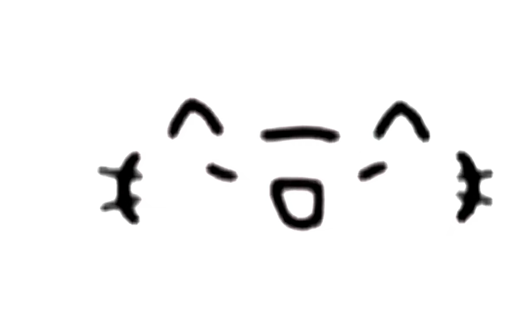

# Qingyang Zhou 
### **Third-Year Computer Science Undergraduate | AI & 3D Vision | Researcher**

**📍Tsinghua University**  
**Research Interests:** AI, 3D Vision, Computer Graphics, Computer Vision, ML Security  

[Download CV](cv_zqy.pdf)

#### **Education**  

September 2022 - Present  
**Tsinghua University**

Xinya College, Tsinghua University: [Xinya College](https://www.xyc.tsinghua.edu.cn/index.htm)  

Department of Computer Science and Technology, Tsinghua University: [Department of Computer Science and Technology](https://www.cs.tsinghua.edu.cn/)  

#### **Research Publications**

**"Curriculum Multi-Reward Reinforcement Learning for Customized Text-to-Image Generation"**  
*Yuwei Zhou, Xin Wang, Hong Chen, Yipeng Zhang, **Qingyang Zhou**, Wenwu Zhu*  
*Submitted to AAAI 2025*  
08 August 2024 (Modified: 10 December 2024)  
[OpenReview PDF](https://openreview.net/pdf?id=kiGUqX6Gct)

#### **Internship & Research Experience**

##### **Scientific Research Internship at Multimedia and Network Big Data Lab** 

📅 *July 2023 - July 2024*  
[📍 Tsinghua University Multimedia and Network Big Data Lab](https://mn.cs.tsinghua.edu.cn/index/index.html)  

- Participated in the research project *"Video Generation System Combining Large Language Models with Diffusion Models."*  
- Conducted research on **diffusion models** and **personalized image generation**.  
- Assisted in publishing the paper: *"Curriculum Multi-Reward Reinforcement Learning for Customized Text-to-Image Generation."*

##### **Scientific Research Internship at Pervasive Human-Computer Interaction Lab**  

📅 *January 2025 - Present*  
[📍 Tsinghua University Pervasive Human-Computer Interaction Lab](https://pi.cs.tsinghua.edu.cn/)  

- Investigating methods to **align human and AI thought processes**.  
- Developing a **writing assistant application**.

##### **Scientific Research Internship at Information Retrieval Lab** 

📅 *October 2024 - Present*  
[📍 Tsinghua University Information Retrieval Lab](http://www.thuir.cn/)  

- Focused on **enhancing the SAE recommendation model**.

#### **Positions of Responsibility**

##### **Secretary of the Intelligent Agent Department**  
📅 *February 2023 - Present*  
📍 Tsinghua University Computer Science and Technology Department, [ Student Science and Technology Association](https://net9.org/home/), Intelligent Agent Department

- Contributed to game development and event organization for the **Intelligent Agent Competition**.  
- Led the development of the **Intelligent Agent-Based Game 'Generals'** in the 28th Tsinghua University Intelligent Agent Competition.

##### **Tutor at Tsinghua University Science and Engineering Summer Camp**  

📅 *July 2024 - August 2024*  
📍 Tsinghua University Science and Engineering Summer Camp  

- Responsible for event organization, providing professional guidance, and facilitating activities.  
- Led and organized **engineering-related projects** such as **intelligent robot design** and **card-bridge construction**.

#### **Skills**

| **Languages**        | Chinese, English, Spanish (Basic Proficiency) |  
|----------------------|----------------------------------------------|  
| **Programming**       | C/C++, Python, Javascript/Typescript, Verilog/SystemVerilog, Java |  
| **Tools**             | Git, Linux, Docker, PyTorch, CUDA, Markdown, LaTeX |  

#### **Projects**

##### **Intelligent Agent-Based Game 'Generals'**  

*September 2023 - May 2024*  
Major Project in the 28th Tsinghua University Intelligent Agent Competition  
[Visit Game](https://www.saiblo.net/game/35)  

- A **Turn-Based Strategy Game** developed as part of the competition.  
- Involved in the game development, focusing on backend logic, writing unit tests, debugging, creating the SDK, authoring documentation, and assisting participants during the competition.

##### **Text Sentiment Analysis Model**  

*May 2024*  
Minor Project as part of curriculum  

- Developed a **text sentiment classification model** to analyze the sentiment of input text.  
- Wrote Python code using **PyTorch** to construct models with **CNN**, **RNN**, and **MLP**, testing model performance. The final model achieved an accuracy rate of over **90%**.

